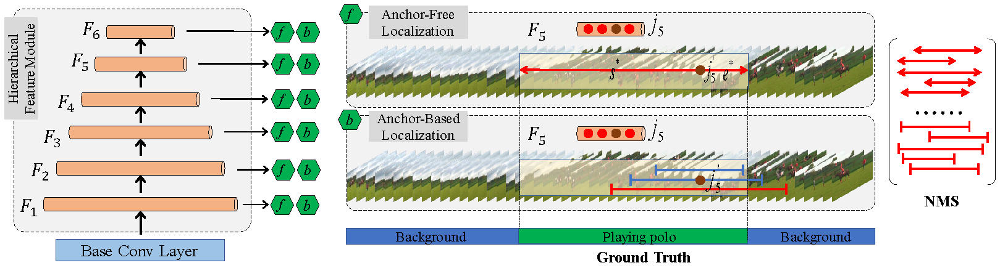

# Revisiting Anchor Mechanisms for Temporal Action Localization

This repository is the official implementation of [Revisiting Anchor Mechanisms for Temporal Action Localization](https://arxiv.org/abs/2030.12345). 
In this work, we study the weakly supervised temporal action localization task. Most of the current action localization methods follow an anchor-based pipeline: depicting action instances by pre-defined anchors, learning to select the anchors closest to the ground truth, and predicting the confidence of anchors with refinements. Pre-defined anchors set prior about the location and duration for action instances, which facilitates the localization for common action instances but limits the flexibility for tackling action instances with drastic varieties, especially for extremely short or extremely long ones. To address this problem, this paper proposes a novel anchor-free action localization module that assists action localization by temporal points. Specifically, this module represents an action instance as a point with its distances to the starting boundary and ending boundary, alleviating the pre-defined anchor restrictions in terms of action localization and duration. The proposed anchor-free module is capable of predicting the action instances whose duration is either extremely short or extremely long. By combining the proposed anchor-free module with a conventional anchor-based module, we propose a novel action localization framework, called A2Net. The cooperation between anchor-free and anchor-based modules achieves superior performance to the state-of-the-art on THUMOS14 (45.5\% vs. 42.8\%). 	Furthermore, comprehensive experiments demonstrate the complementarity between the anchor-free and the anchor-based module, making A2Net simple but effective.




## Requirements

To install requirements:

```setup
conda env create -f environment.yaml
```

Before running the code, please activate this conda environment.

## Data Preparation

Download Thumos14 from [BaiDuYun](https://drive.google.com/drive/folders/1GJi4yZROTNURo1j-TJlUfs0MBsITJ0Ug?usp=sharing).

Download ActivityNet1.3  features from [BaiDuYun](https://drive.google.com/drive/folders/1klht1i1HfNoxiss2UWBqdIznkeQAbxvc).	

	Please ensure the data structure is as below

~~~~
├── data
   └── thumos
       ├── val
           ├── video_validation_0000051.npz
           ├── video_validation_0000052.npz
           └── ...
       └── test
           ├── video_test_0000004.npz
           ├── video_test_0000006.npz
           └── ...
   └── anet13
       ├── training
           ├── v___c8enCfzqw.npz
           ├── v___dXUJsj3yo.npz
           └── ...
       └── validation
           ├── v__1vYKA7mNLI.npz
           ├── v__3I4nm2zF5Y.npz
           └── ...
     
~~~~

## Training

To train the A2Net model on THUMOS14 dataset, please first modify parameters in:
```parameters
./experiments/thumos/A2Net.yaml
```
Then run this command:
```train
cd ./tools
python train.py
```

To train the A2Net model on ActivityNet v1.3 dataset, please first modify parameters in:
```parameters
./experiments/anet/A2Net.yaml
```

Then run this command:
```train
cd ./tools
python train.py
```


## Evaluation

To evaluate A2Net model on Thumos14, run:

```eval
python eval.py -cfg ./experiments/thumos/A2Net.yaml -weight_file ../checkpoints/THUMOS14.pth
```

To evaluate A2Net model on ActivityNet1.3, run:

```eval
python eval.py -cfg ./experiments/anet/A2Net.yaml -weight_file ../checkpoints/ActivityNet1.3.pth
```


## Pre-trained Models

You can download pretrained models here:

- [THUMOS14.pth](https://pan.baidu.com/s/1YGk6bK-UVkBLUD4zBtYfyg), (code: 4550), trained on THUMOS14 using parameters same as "./experiments/thumos/A2Net.yaml". 
- [ActivityNet1.3.pth](https://pan.baidu.com/s/1-9RqDywS9trolwf-fg_b8Q), (code: 2870) trained on ActivityNet v1.3 using parameters same as "./experiments/anet/A2Net.yaml". 


## Results

Our model achieves the following performance on :

### [THUMOS14](https://www.crcv.ucf.edu/THUMOS14/home.html)

| threshold | 0.1   | 0.2   | 0.3   | 0.4   | 0.5   | 0.6   | 0.7   |
| --------- | ----- | ----- | ----- | ----- | ----- | ----- | ----- |
| mAP       | 61.1  | 60.2  | 58.6  | 54.1  | 45.5  | 32.5  | 17.2  |


### [ActivityNet v1.3](http://activity-net.org/)

| threshold | average-mAP | 0.50  | 0.55  | 0.60  | 0.65  | 0.70  | 0.75  | 0.80  | 0.85  | 0.90  | 0.95 |
| --------- | ----------- | ----- | ----- | ----- | ----- | ----- | ----- | ----- | ----- | ----- | ---- |
| mAP       | 28.70       | 44.52       | 42.18 | 39.41 | 36.49 | 33.47 | 29.32 | 24.22 | 19.40 | 12.83 | 5.17 |


### Contact

If you have any questions, please file an issue or contact [Le Yang](nwpuyangle@gmail.com) or [Tao Zhao](taozhao2011@gmail.com).

